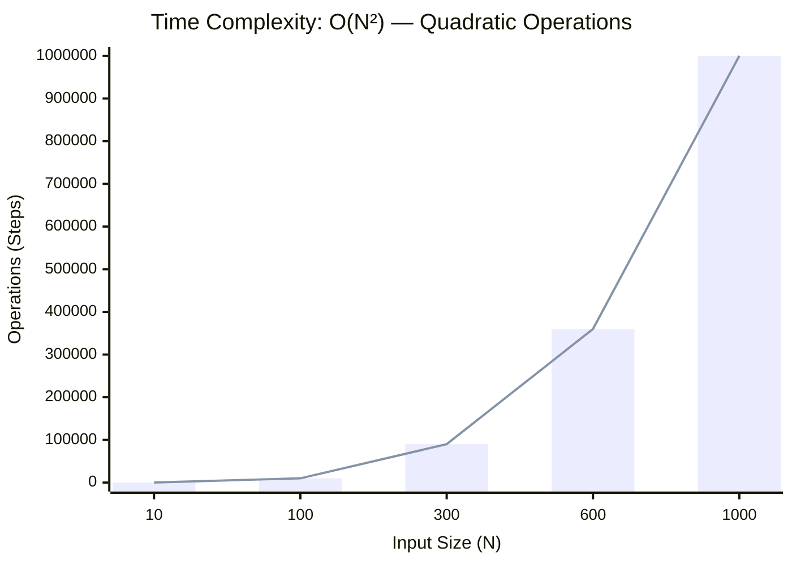
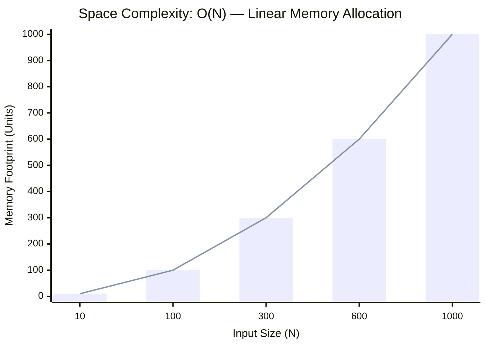

<h2><a href="https://www.hackerrank.com/challenges/2d-array/problem?isFullScreen=true">2D Array - DS</a></h2><h3>Medium</h3>

Given a  2D array, , an hourglass is a subset of values with indices falling in the following pattern:

a b c     d   e f g

There are  hourglasses in a  array. The  is the sum of the values in an hourglass. Calculate the hourglass sum for every hourglass in , then print the  hourglass sum.

Example

-9 -9 -9  1 1 1   0 -9  0  4 3 2 -9 -9 -9  1 2 3  0  0  8  6 6 0  0  0  0 -2 0 0  0  0  1  2 4 0

The  hourglass sums are:

-63, -34, -9, 12,  -10,   0, 28, 23,  -27, -11, -2, 10,    9,  17, 25, 18

The highest hourglass sum is  from the hourglass beginning at row , column :

0 4 3   1 8 6 6

Note: If you have already solved the Java domain's Java 2D Array challenge, you may wish to skip this challenge.

Function Description

Complete the function  with the following parameter(s):

: a 2-D array of integers

Returns

: the maximum hourglass sum

Input Format

Each of the  lines of inputs  contains  space-separated integers .

Constraints

Sample Input

1 1 1 0 0 0 0 1 0 0 0 0 1 1 1 0 0 0 0 0 2 4 4 0 0 0 0 2 0 0 0 0 1 2 4 0

Sample Output

19

Explanation

contains the following hourglasses:

The hourglass with the maximum sum () is:

2 4 4   2 1 2 4

### 📊 Submission Statistics
- **Language:** `cpp`
- **Runtime:** `N/A`
- **Memory:** `N/A`
- **Submission Date:** Tue, 25 Aug 2026 17:45:14 GMT

---

### 💡 Approach & Complexity Analysis
#### 🧠 Intuition & Algorithmic Strategy
- **Approach:** Utilizes frequency counting or presence tracking via hash mapping for O(1) membership queries.
- **Flow:**
  1. Initialize state variables and inspect base constraints.
  2. Iterate through input elements, maintaining current progress and boundaries.
  3. Return the calculated result satisfying problem criteria.

#### ⏱️ Complexity Analysis
- **Time Complexity:** $\mathcal{O}(N^2) \text{ or } \mathcal{O}(N \times M)$ — *Nested iteration processing combinations or grid cells.*
- **Space Complexity:** $\mathcal{O}(N)$ — *Auxiliary hash-based lookup structure storing up to N elements.*

#### 📈 Time Complexity Graph (Operations vs Input Size $N$)

#### 📦 Space Complexity Graph (Memory Footprint vs Input Size $N$)

---
*Auto-synced with [LeetGitSyncPro](https://synccode-pro.pages.dev) & [DSATracker](https://dsatracker.in)*
