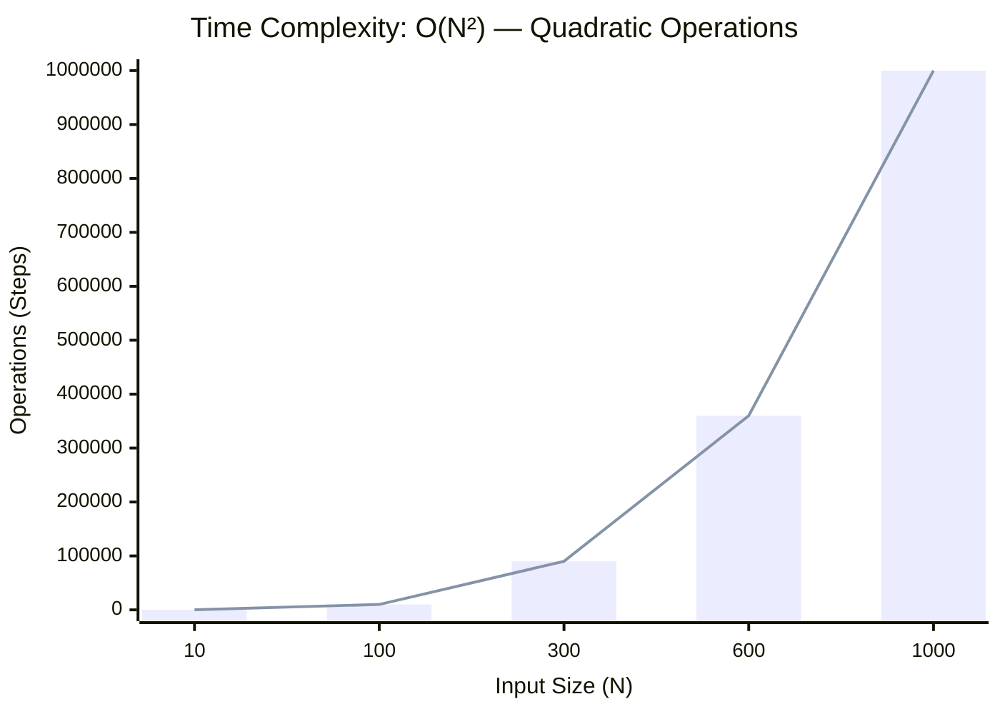
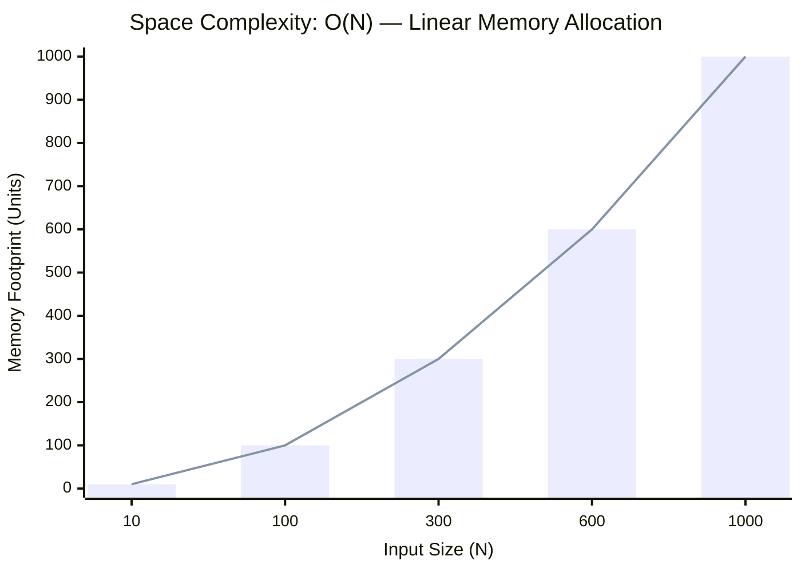

<h2><a href="https://leetcode.com/problems/find-the-largest-almost-missing-integer/submissions/2117771669/?envType=daily-question&envId=2026-08-23">3471. Find the Largest Almost Missing Integer</a></h2><h3>Easy</h3>

You are given an integer array <code>nums</code> and an integer <code>k</code>.

An integer <code>x</code> is <strong>almost missing</strong> from <code>nums</code> if <code>x</code> appears in <em>exactly</em> one subarray of size <code>k</code> within <code>nums</code>.

Return the <b>largest</b> <strong>almost missing</strong> integer from <code>nums</code>. If no such integer exists, return <code>-1</code>.

A <strong>subarray</strong> is a contiguous sequence of elements within an array.

&nbsp;

<strong class="example">Example 1:</strong>

<strong>Input:</strong> nums = [3,9,2,1,7], k = 3

<strong>Output:</strong> 7

<strong>Explanation:</strong>

<ul>
	<li>1 appears in 2 subarrays of size 3: <code>[9, 2, 1]</code> and <code>[2, 1, 7]</code>.</li>
	<li>2 appears in 3 subarrays of size 3: <code>[3, 9, 2]</code>, <code>[9, 2, 1]</code>, <code>[2, 1, 7]</code>.</li>
	<li index="2">3 appears in 1 subarray of size 3: <code>[3, 9, 2]</code>.</li>
	<li index="3">7 appears in 1 subarray of size 3: <code>[2, 1, 7]</code>.</li>
	<li index="4">9 appears in 2 subarrays of size 3: <code>[3, 9, 2]</code>, and <code>[9, 2, 1]</code>.</li>
</ul>

We return 7 since it is the largest integer that appears in exactly one subarray of size <code>k</code>.

<strong class="example">Example 2:</strong>

<strong>Input:</strong> nums = [3,9,7,2,1,7], k = 4

<strong>Output:</strong> 3

<strong>Explanation:</strong>

<ul>
	<li>1 appears in 2 subarrays of size 4: <code>[9, 7, 2, 1]</code>, <code>[7, 2, 1, 7]</code>.</li>
	<li>2 appears in 3 subarrays of size 4: <code>[3, 9, 7, 2]</code>, <code>[9, 7, 2, 1]</code>, <code>[7, 2, 1, 7]</code>.</li>
	<li>3 appears in 1 subarray of size 4: <code>[3, 9, 7, 2]</code>.</li>
	<li>7 appears in 3 subarrays of size 4: <code>[3, 9, 7, 2]</code>, <code>[9, 7, 2, 1]</code>, <code>[7, 2, 1, 7]</code>.</li>
	<li>9 appears in 2 subarrays of size 4: <code>[3, 9, 7, 2]</code>, <code>[9, 7, 2, 1]</code>.</li>
</ul>

We return 3 since it is the largest and only integer that appears in exactly one subarray of size <code>k</code>.

<strong class="example">Example 3:</strong>

<strong>Input:</strong> nums = [0,0], k = 1

<strong>Output:</strong> -1

<strong>Explanation:</strong>

There is no integer that appears in only one subarray of size 1.

&nbsp;

<strong>Constraints:</strong>

<ul>
	<li><code>1 &lt;= nums.length &lt;= 50</code></li>
	<li><code>0 &lt;= nums[i] &lt;= 50</code></li>
	<li><code>1 &lt;= k &lt;= nums.length</code></li>
</ul>

### 📊 Submission Statistics
- **Language:** `cpp`
- **Runtime:** `7 ms` (Beats **22.38%**)
- **Memory:** `29.18 MB` (Beats **70.81%**)
- **Submission Date:** Sun, 23 Aug 2026 19:35:43 GMT

---

### 💡 Approach & Complexity Analysis
#### 🧠 Intuition & Algorithmic Strategy
- **Approach:** Utilizes frequency counting or presence tracking via hash mapping for O(1) membership queries.
- **Flow:**
  1. Initialize state variables and inspect base constraints.
  2. Iterate through input elements, maintaining current progress and boundaries.
  3. Return the calculated result satisfying problem criteria.

#### ⏱️ Complexity Analysis
- **Time Complexity:** $\mathcal{O}(N^2) \text{ or } \mathcal{O}(N \times M)$ — *Nested iteration processing combinations or grid cells.*
- **Space Complexity:** $\mathcal{O}(N)$ — *Auxiliary hash-based lookup structure storing up to N elements.*

#### 📈 Time Complexity Graph (Operations vs Input Size $N$)

#### 📦 Space Complexity Graph (Memory Footprint vs Input Size $N$)

---
*Auto-synced with [SyncCode Pro](https://github.com/pkmahto009/leetcode-github-sync) & [DSATracker](https://dsatracker.in)*
