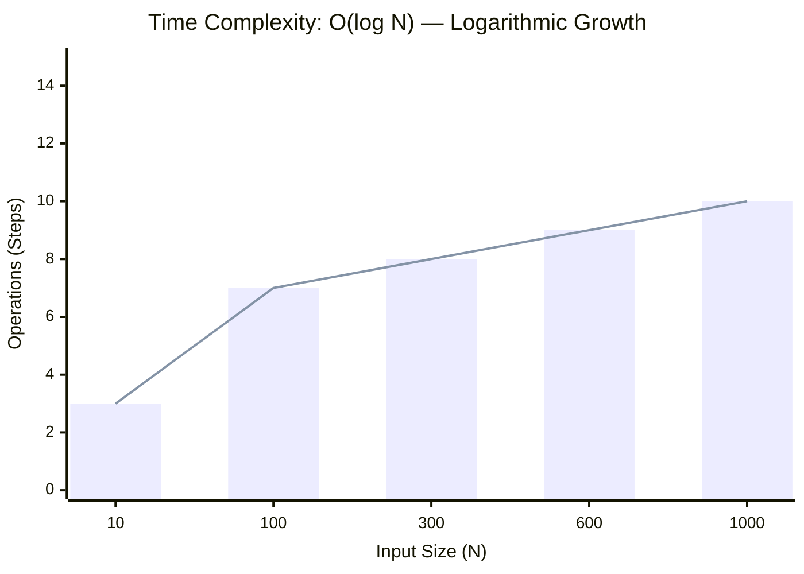
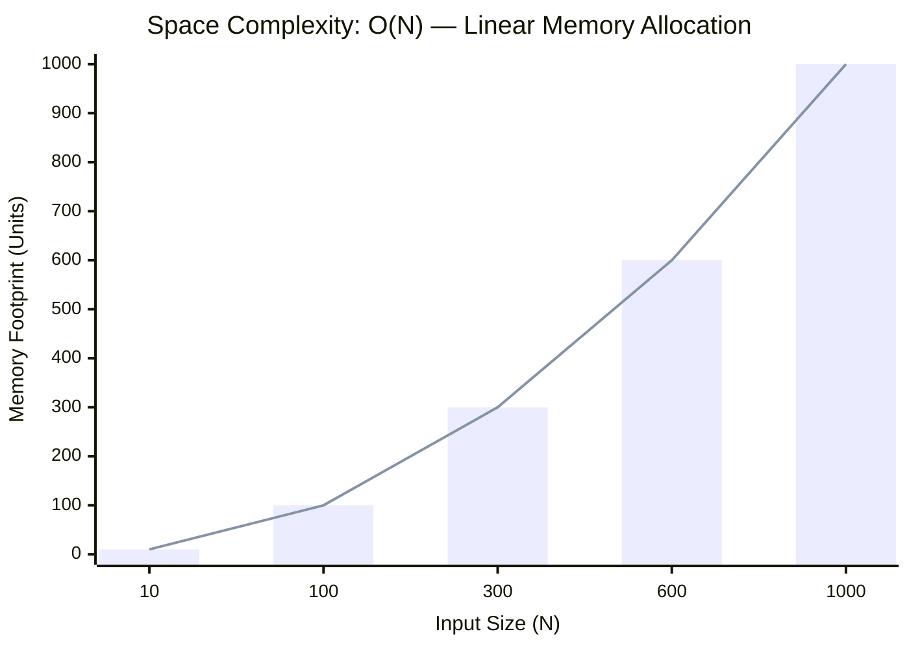

<h2><a href="https://leetcode.com/problems/binary-search/">Binary Search</a></h2><h3>Easy</h3>

Given an array of integers nums which is sorted in ascending order, and an integer target, write a function to search target in nums. If target exists, then return its index. Otherwise, return -1.

You must write an algorithm with O(log n) runtime complexity.

Example 1:

Input: nums = [-1,0,3,5,9,12], target = 9 Output: 4 Explanation: 9 exists in nums and its index is 4

Example 2:

Input: nums = [-1,0,3,5,9,12], target = 2 Output: -1 Explanation: 2 does not exist in nums so return -1

Constraints:

1 <= nums.length <= 104 	-104 < nums[i], target < 104 	All the integers in nums are unique. 	nums is sorted in ascending order.

### 📊 Submission Statistics
- **Language:** `cpp`
- **Runtime:** `0 ms`
- **Memory:** `31.43 MB` (Beats **31.43%**)
- **Submission Date:** Thu, 27 Aug 2026 15:10:05 GMT

---

### 💡 Approach & Complexity Analysis
#### 🧠 Intuition & Algorithmic Strategy
- **Approach:** Performs logarithmic range reduction to locate target elements in monotonic space.
- **Flow:**
  1. Initialize state variables and inspect base constraints.
  2. Iterate through input elements, maintaining current progress and boundaries.
  3. Return the calculated result satisfying problem criteria.

#### ⏱️ Complexity Analysis
- **Time Complexity:** $\mathcal{O}(\log N)$ — *Binary search halving the search space each iteration.*
- **Space Complexity:** $\mathcal{O}(N)$ — *Auxiliary hash-based lookup structure storing up to N elements.*

#### 📈 Time Complexity Graph (Operations vs Input Size $N$)

#### 📦 Space Complexity Graph (Memory Footprint vs Input Size $N$)

---
*Auto-synced with [LeetGitSyncPro](https://synccode-pro.pages.dev) & [DSATracker](https://dsatracker.in)*
