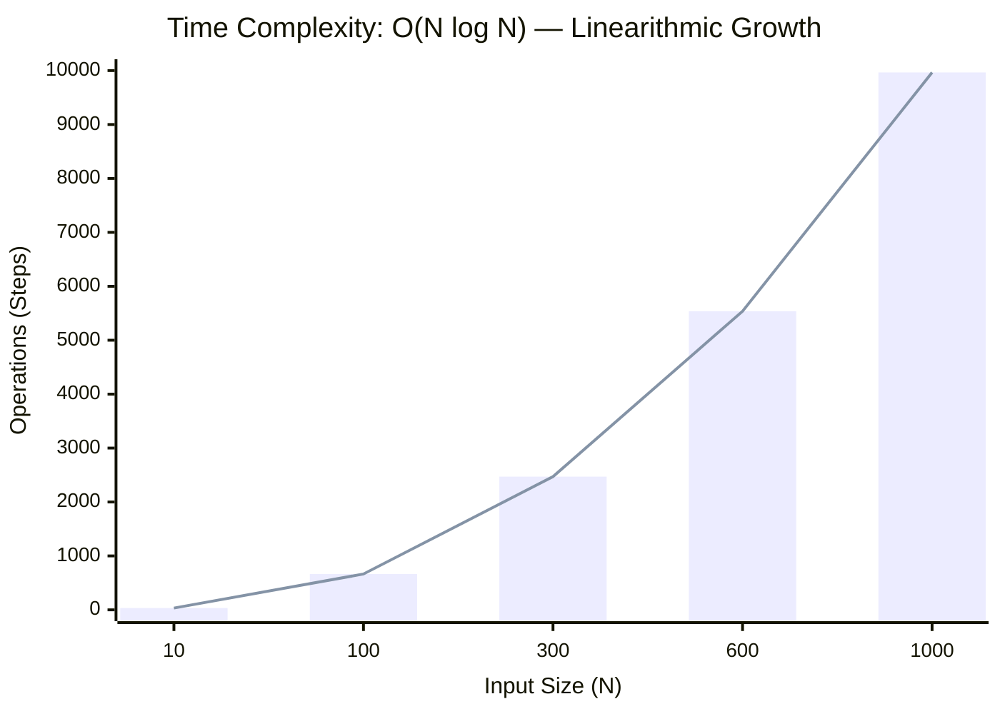
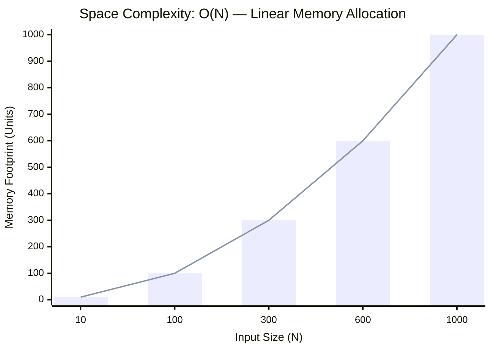

<h2><a href="https://www.geeksforgeeks.org/problems/fractional-knapsack-1587115620/1">Fractional Knapsack</a></h2><h3>Easy</h3>

Given two arrays, <strong>val[]&nbsp;</strong>and <strong>wt[]</strong> , representing the values and weights of items, and an integer capacity<strong> </strong>representing the maximum weight a knapsack can hold, determine the maximum total value that can be achieved by putting items in the knapsack. You are allowed to break items into fractions<strong> </strong>if necessary. Return the maximum<strong> </strong>value as a double, rounded to 6 decimal places.

<strong>Examples :</strong>

<pre><strong>Input:</strong> val[] = [60, 100, 120], wt[] = [10, 20, 30], capacity = 50
<strong>Output: </strong>240.000000<strong>
Explanation: </strong>By taking items of weight 10 and 20 kg and 2/3 fraction of 30 kg. Hence total price will be 60+100+(2/3)(120) = 240
</pre>
<pre><strong>Input: </strong>val[] = [500], wt[] = [30], capacity = 10
<strong>Output: </strong>166.670000<strong>
Explanation: </strong>Since the item’s weight exceeds capacity, we take a fraction 10/30 of it, yielding value 166.670000.</pre>

<strong>Constraints:</strong> 1 ≤ val.size = wt.size ≤ 105 1 ≤ capacity ≤ 109 1 ≤ val[i], wt[i] ≤ 104

### 📊 Submission Statistics
- **Language:** `cpp`
- **Runtime:** `1115s (1115000ms)`
- **Memory:** `N/A`
- **Test Cases:** `2/3 Passed`
- **Accuracy:** `32.46%`
- **Submission Date:** Tue, 25 Aug 2026 18:08:56 GMT

---

### 💡 Approach & Complexity Analysis
#### 🧠 Intuition & Algorithmic Strategy
- **Approach:** Orders the elements to greedily identify optimal candidates or missing targets.
- **Flow:**
  1. Initialize state variables and inspect base constraints.
  2. Iterate through input elements, maintaining current progress and boundaries.
  3. Return the calculated result satisfying problem criteria.

#### ⏱️ Complexity Analysis
- **Time Complexity:** $\mathcal{O}(N \log N)$ — *Sorting the input elements dominates the time complexity.*
- **Space Complexity:** $\mathcal{O}(N)$ — *Auxiliary hash-based lookup structure storing up to N elements.*

#### 📈 Time Complexity Graph (Operations vs Input Size $N$)

#### 📦 Space Complexity Graph (Memory Footprint vs Input Size $N$)

---
*Auto-synced with [LeetGitSyncPro](https://synccode-pro.pages.dev) & [DSATracker](https://dsatracker.in)*
