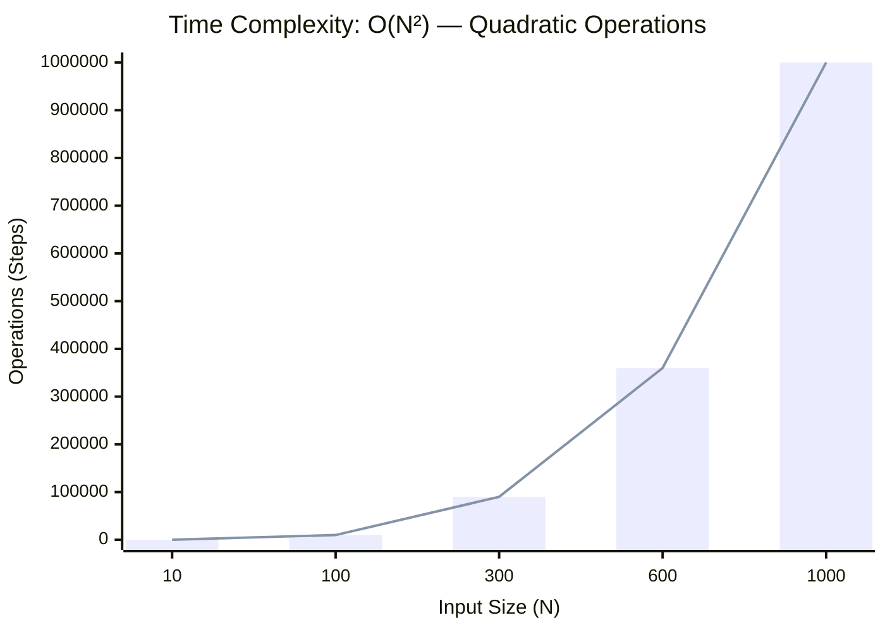
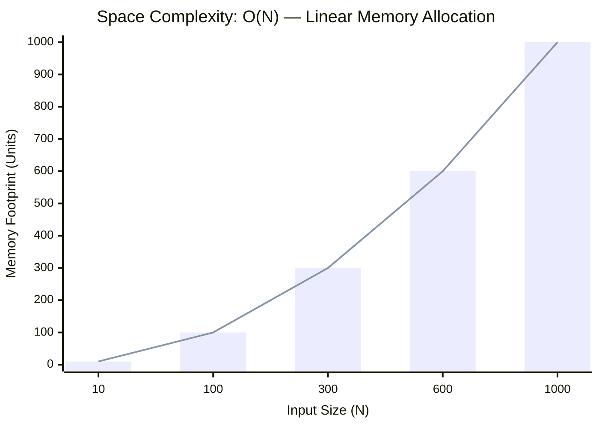

<h2><a href="https://www.naukri.com/code360/problems/pair-sum_697295?interviewProblemRedirection=true&leftPanelTabValue=SUBMISSION&customSource=studio_nav">Current submission</a></h2><h3>Easy</h3>

<h2 _ngcontent-serverapp-c239="" class="problem-statement-title zen-typo-subtitle-small"> Problem statement </h2><ninjas-problems-ui-send-feedback-button _ngcontent-serverapp-c239="" _nghost-serverapp-c238="">
<button _ngcontent-serverapp-c238="" zen-gray-underlined-text-cta="" size="small" class="zen-base-cta zen-gray-underlined-text-cta zen-cta-base zen-cta-small"> Send feedback </button>
</ninjas-problems-ui-send-feedback-button>

You are given an integer array 'ARR' of size 'N' and an integer 'S'. Your task is to return the list of all pairs of elements such that each sum of elements of each pair equals 'S'.

Note:

<pre><code>Each pair should be sorted i.e the first value should be less than or equals to the second value. 

Return the list of pairs sorted in non-decreasing order of their first value. In case if two pairs have the same first value, the pair with a smaller second value should come first.
</code></pre>

<!---->

 Detailed explanation  ( Input/output format, Notes, Images ) 

<mat-icon _ngcontent-serverapp-c239="" role="img" fontset="zen-icon" fonticon="icon-chevron-down" class="mat-icon notranslate icon-chevron-down zen-icon mat-icon-no-color" aria-hidden="true" data-mat-icon-type="font" data-mat-icon-name="icon-chevron-down" data-mat-icon-namespace="zen-icon"></mat-icon>

<b id="input-format">Input Format:</b>

<pre><code>The first line of input contains two space-separated integers 'N' and 'S', denoting the size of the input array and the value of 'S'.

The second and last line of input contains 'N' space-separated integers, denoting the elements of the input array: ARR[i] where 0 &lt;= i &lt; 'N'.
</code></pre>

<b id="output-format">Output Format:</b>

<pre><code>Print 'C' lines, each line contains one pair i.e two space-separated integers, where 'C' denotes the count of pairs having sum equals to given value 'S'.
</code></pre>

<b id="note">Note:</b>

<pre><code>You are not required to print the output, it has already been taken care of. Just implement the function.
</code></pre>

<!---->
<b id="constraints">Constraints:</b>

<pre><code>1 &lt;= N &lt;= 10^3
-10^5 &lt;= ARR[i] &lt;= 10^5
-2 * 10^5 &lt;= S &lt;= 2 * 10^5

Time Limit: 1 sec
</code></pre>
<!---->
<h5>Sample Input 1:</h5>

<pre><code>5 5
1 2 3 4 5
</code></pre>

<h5>Sample Output 1:</h5>

<pre><code>1 4
2 3
</code></pre>

<h5>Explaination For Sample Output 1:</h5>

<pre><code>Here, 1 + 4 = 5
      2 + 3 = 5
Hence the output will be, (1,4) , (2,3).
</code></pre>

<h5>Sample Input 2:</h5>

<pre><code>5 0
2 -3 3 3 -2
</code></pre>

<h5>Sample Output 2:</h5>

<pre><code>-3 3
-3 3
-2 2
</code></pre>

<!----><!----><!----><!----><!---->

### 📊 Submission Statistics
- **Language:** `cpp`
- **Runtime:** `0 ms`
- **Memory:** `N/A`
- **Test Cases:** `8 / 8 Passed`
- **Submission Date:** Tue, 25 Aug 2026 18:06:17 GMT

---

### 💡 Approach & Complexity Analysis
#### 🧠 Intuition & Algorithmic Strategy
- **Approach:** Orders the elements to greedily identify optimal candidates or missing targets.
- **Flow:**
  1. Initialize state variables and inspect base constraints.
  2. Iterate through input elements, maintaining current progress and boundaries.
  3. Return the calculated result satisfying problem criteria.

#### ⏱️ Complexity Analysis
- **Time Complexity:** $\mathcal{O}(N^2) \text{ or } \mathcal{O}(N \times M)$ — *Nested iteration processing combinations or grid cells.*
- **Space Complexity:** $\mathcal{O}(N)$ — *Auxiliary hash-based lookup structure storing up to N elements.*

#### 📈 Time Complexity Graph (Operations vs Input Size $N$)

#### 📦 Space Complexity Graph (Memory Footprint vs Input Size $N$)

---
*Auto-synced with [LeetGitSyncPro](https://synccode-pro.pages.dev) & [DSATracker](https://dsatracker.in)*
