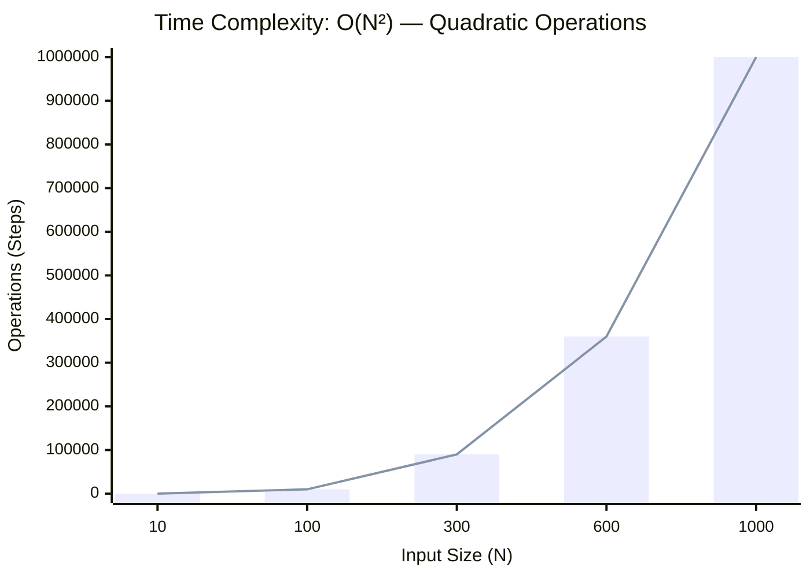
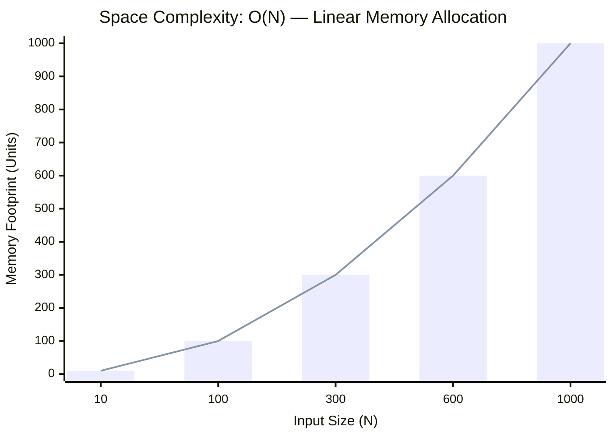

<h2><a href="https://www.naukri.com/code360/problems/pair-sum_697295?interviewProblemRedirection=true&leftPanelTabValue=SUBMISSION&customSource=studio_nav">Previous submissions</a></h2><h3>Medium</h3>

<h2 _ngcontent-serverapp-c239="" class="problem-statement-title zen-typo-subtitle-small"> Problem statement </h2><ninjas-problems-ui-send-feedback-button _ngcontent-serverapp-c239="" _nghost-serverapp-c238="">
<button _ngcontent-serverapp-c238="" zen-gray-underlined-text-cta="" size="small" class="zen-base-cta zen-gray-underlined-text-cta zen-cta-base zen-cta-small"> Send feedback </button>
</ninjas-problems-ui-send-feedback-button>

<!----><!----><!----><!---->

### 📊 Submission Statistics
- **Language:** `cpp`
- **Runtime:** `N/A`
- **Memory:** `N/A`
- **Submission Date:** Tue, 25 Aug 2026 18:36:42 GMT

---

### 💡 Approach & Complexity Analysis
#### 🧠 Intuition & Algorithmic Strategy
- **Approach:** Orders the elements to greedily identify optimal candidates or missing targets.
- **Flow:**
  1. Initialize state variables and inspect base constraints.
  2. Iterate through input elements, maintaining current progress and boundaries.
  3. Return the calculated result satisfying problem criteria.

#### ⏱️ Complexity Analysis
- **Time Complexity:** $\mathcal{O}(N^2) \text{ or } \mathcal{O}(N \times M)$ — *Nested iteration processing combinations or grid cells.*
- **Space Complexity:** $\mathcal{O}(N)$ — *Auxiliary hash-based lookup structure storing up to N elements.*

#### 📈 Time Complexity Graph (Operations vs Input Size $N$)

#### 📦 Space Complexity Graph (Memory Footprint vs Input Size $N$)

---
*Auto-synced with [LeetGitSyncPro](https://synccode-pro.pages.dev) & [DSATracker](https://dsatracker.in)*
